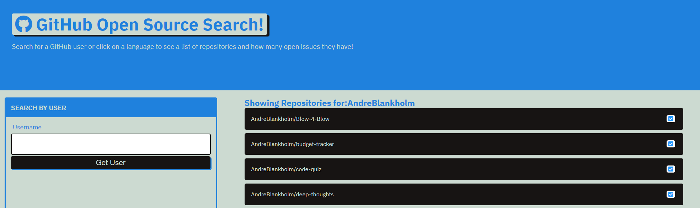

# github-opensource-directory
## A web app that will search GitHub for open source projects, dispaly them and the open issues.

Screenshot:
# 

## Link: https://andreblankholm.github.io/github-opensource-directory/

The MIT license 
## 
### License & copyright 2022 © Andre Blankholm